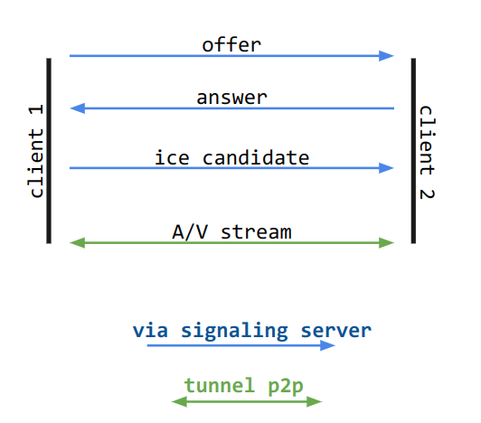

# Pair à Peirb
*Application de videoconférence en P2P, sous node.js*

### Lancement
Le serveur nécessite les modules **socket.io** et **express**, on installe les dépendances avec
```bash
npm i
```
Puis lancer le serveur avec
```bash
node server.js
```

### Fonctionnement

Le serveur `server.js` sert statiquement le front-end ( répertoire `/frontend` ).

Ce frontend est accompagné du script client `webRTC.js` qui se connecte au serveur au travers d'un websocket. Cette connexion sert à échanger les événements `client <=> serveur`.

Le serveur assure également le rôle de **serveur de signalement** via ce websocket (via le topic *"webRTC*").




### API Socket.io

Ce paragraphe liste les événements **socket.io** constituant l'API de l'application.


Les événements **client -> serveur**:

- *"join-room"* permet à un utilisateur de rejoindre un canal en fournissant le nom de celui-ci.
- *"new-text"* permet à l'utilisateur d'envoyer un message textuel. Le serveur se charge ensuite de l'envoyer aux autres clients connectés sur le même canal.

Les événements **serveur -> client**:
- *"new-room"* envoie aux clients les informations relatif à un canal. Cela permet d'envoyer une liste des canaux disponible aux nouveaux utilisateurs, ainsi que de leurs envoyer les canaux nouvellement créés.
- *"new-text"* envoie aux clients d'un canal un message en provenance d'un utilisateur du même canal, ou du serveur lui même.
- *"new-user"* envoie aux clients d'un canal l'identifiant d'un nouvel utilisateur, permettant ainsi l'envoie de message webRTC à ce dernier, pour ensuite pouvoir établir une connexion p2p.
- *"delete-user"* informe les utilisateurs de la déconnexion d'un client du canal. Cela permet de supprimer proprement la connection p2p, pour éviter toute fuite mémoire.
